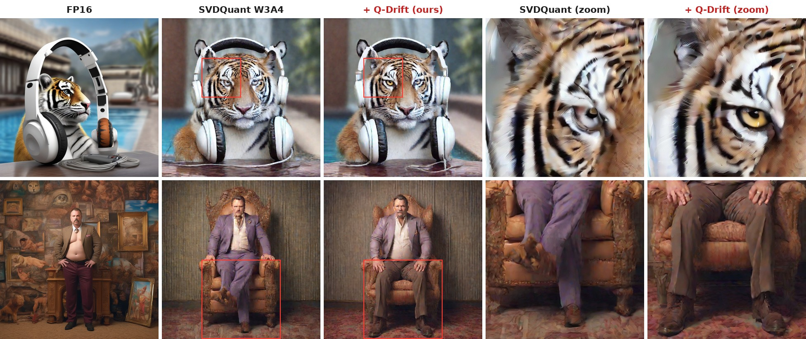

<div align="center">

# Q-Drift: Quantization-Aware Drift Correction for Diffusion Model Sampling

**Sooyoung Ryu**<sup>1</sup> &nbsp;&nbsp; **Mathieu Salzmann**<sup>2</sup> &nbsp;&nbsp; **Saqib Javed**<sup>2</sup>

<sup>1</sup>Seoul National University &nbsp;&nbsp; <sup>2</sup>EPFL

[](#citation)&nbsp;
[](#method)&nbsp;
[](#results)

</div>

<p align="center">
  
</p>
<p align="center"><em>SDXL with SVDQuant W3A4. Q-Drift changes only the sampler: same quantized weights, same prompt, same initial noise.</em></p>

**TL;DR** Q-Drift is a plug-and-play sampler correction for quantized diffusion models. It rescales each denoising step by one calibrated scalar, needs no retraining or weight changes, and adds negligible inference cost. It improves FID in all seven main settings across six text-to-image models, three samplers, and two PTQ methods.

## Contents

- [Highlights](#highlights)
- [Method](#method)
- [Results](#results)
- [Reproducing the paper](#reproducing-the-paper)
  - [Repository layout](#repository-layout) · [Install](#install) · [Data and checkpoints](#download-data-and-checkpoints) · [Main experiments](#main-experiments) · [SDXL studies](#sdxl-studies-and-prior-corrections) · [Fresh quantization](#optional-fresh-quantization-and-calibration) · [Evaluation](#evaluate-saved-images)
- [Citation](#citation)

## Highlights

- **Sampler-side and plug-and-play.** Q-Drift complements PTQ methods such as SVDQuant and MixDQ. It leaves the network untouched and changes only how each update is applied.
- **One scalar per step.** The correction is a single precomputed factor per sampling step, derived from the conditional residual variance of the quantization error.
- **Cheap calibration.** On SDXL, statistics from as few as **10** paired full-precision/quantized runs stay within 0.17 FID of the 1,000-run reference, even for adversarially selected subsets.
- **Broad coverage.** FLUX.1-dev, FLUX.1-schnell, SDXL, SDXL-Turbo, PixArt-Σ, and Sana; DiT and U-Net backbones; Euler, flow-matching, and DPM-Solver++ samplers.

## Method

Quantization perturbs every denoiser output, and in iterative sampling these perturbations accumulate along the trajectory. Q-Drift treats the part of the quantization error that the quantized output cannot explain as an implicit stochastic perturbation. It matches its variance to the diffusion term of a generalized marginal-preserving SDE, and applies the drift paired with that diffusion as a deterministic rescaling of the quantized update:

$$
\mathbf{x}_{i+1} = \mathbf{x}_i + \Delta\sigma_i\,(1+c_i)\,\hat{\epsilon}_\theta(\mathbf{x}_i,\sigma_i,c),
\qquad
c_i = \frac{|\Delta\sigma_i|}{2\sigma_i}\,V_{\sigma_i},
$$

where $V_{\sigma_i}=\mathbb{E}\big[\mathrm{Var}(\Delta\epsilon_i \mid \hat{\epsilon}_\theta)\big]$ is the conditional residual variance of the quantization error, estimated offline from paired full-precision/quantized runs. The update keeps the direction of the quantized step and adjusts only its magnitude, without injecting noise. The same principle extends to flow-matching and DPM-Solver++ samplers (see the paper appendix).

## Results

FID and CLIP on 5,000 MJHQ-30K prompts. Q-Drift is applied at sampling time on top of the same quantized model.

| Model | PTQ | FP16 FID | Quantized FID | **Q-Drift FID** | ΔFID | Q-Drift CLIP (Quantized) |
|:--|:--|:--:|:--:|:--:|:--:|:--:|
| FLUX.1-dev | SVDQuant W3A4 | 20.68 | 24.14 | **24.06** | −0.08 | 24.69 (24.66) |
| FLUX.1-schnell | SVDQuant W3A4 | 19.18 | 23.10 | **22.13** | −0.97 | 25.57 (25.43) |
| SDXL | SVDQuant W3A4 | 17.20 | 31.73 | **30.69** | −1.04 | 26.40 (26.39) |
| SDXL-Turbo | SVDQuant W3A4 | 24.77 | 29.17 | **27.64** | −1.53 | 26.38 (26.38) |
| SDXL-Turbo | MixDQ W4A8 | 24.77 | 28.37 | **27.38** | −0.99 | 25.87 (25.90) |
| PixArt-Σ | SVDQuant W3A4 | 16.52 | 48.85 | **44.06** | −4.79 | 24.56 (24.41) |
| Sana | SVDQuant W3A4 | 15.98 | 17.32 | **16.54** | −0.78 | 27.20 (27.19) |

Q-Drift also lowers KID in all seven settings, and the paired 95% bootstrap interval of ΔFID lies below zero in six of them. The paper additionally reports comparisons with PTQD, QNCD, and D²-DPM, calibration-size and design ablations, and milder quantization settings.

## Reproducing the paper

Run all commands from this folder (the one containing this README). They require Linux, an NVIDIA GPU, a CUDA development toolkit (`nvcc`), and a C++17 compiler. Every evaluation uses 5,000 MJHQ-30K prompts.

## Repository layout

```text
experiments/svdquant/<model>/        SVDQuant W3A4 settings (run_paper.sh, model scripts)
experiments/svdquant/sdxl_w3a4_*/    SDXL calibration-subset, PTQD, and QNCD scripts
experiments/mixdq/sdxl-turbo_w4a8/   MixDQ W4A8 setting
schedulers/                          Q-Drift samplers (Euler, Euler ancestral, DPM-Solver++, flow matching)
evaluation/                          FID/CLIP/PSNR/LPIPS/SSIM, KID, and bootstrap intervals
scripts/                             data and artifact installers, statistics fitting, SDXL study runner
manifests/                           artifact hashes, MJHQ-30K splits, metric manifests
third_party/                         vendored DeepCompressor (SVDQuant) and MixDQ code
```

## Install

```bash
conda create --override-channels -c conda-forge -n qdrift python=3.11.14 -y
conda activate qdrift
pip install -r environments/requirements-svdquant.txt
pip install --no-deps -e ./third_party/deepcompressor
```

For MixDQ, also run:

```bash
pip install --extra-index-url https://download.pytorch.org/whl/cu121 -r environments/requirements-mixdq.txt
pip install --no-deps -e ./third_party/mixdq/quant_utils
```

Accept the provider's terms and authenticate with Hugging Face for gated base models. Optionally, run the unit tests with `pip install pytest && pytest tests`.

## Download data and checkpoints

```bash
python scripts/prepare_data.py
python scripts/prepare_paper_artifacts.py
export META_PATH="$PWD/data/meta_data.json"
export MJHQ_META_PATH="$META_PATH"
```

`prepare_data.py` downloads the MJHQ-30K metadata and builds the 5,000-image FID reference in `data/mjhq_fid_reference/`. `prepare_paper_artifacts.py` installs the quantized checkpoints and fitted statistics and verifies their SHA256.

## Main experiments

SVDQuant (all six models):

```bash
for model in sdxl_w3a4 flux.1-dev_w3a4 flux.1-schnell_w3a4 \
             sdxl-turbo_w3a4 pixart-sigma_w3a4 sana_w3a4; do
  NUM_GPUS=1 STAGE=generate bash "experiments/svdquant/$model/run_paper.sh" || exit 1
  STAGE=metrics bash "experiments/svdquant/$model/run_paper.sh" || exit 1
done
```

Results: `experiments/svdquant/<model>/evaluation_paper/evaluation_metrics_only.json`.

MixDQ (uses the SDXL-Turbo FP16 images from the SVDQuant loop above as its FP reference):

```bash
NUM_GPUS=1 bash experiments/mixdq/sdxl-turbo_w4a8/run_paper.sh generate metrics
```

Results: `experiments/mixdq/sdxl-turbo_w4a8/evaluation_paper/evaluation_metrics_only.json`.

## SDXL studies and prior corrections

```bash
for target in k10-maxabs k10-min-signed k10-max-signed \
              ablation-scalar ablation-unconditional ablation-channelwise \
              prior-d2-deterministic prior-d2-stochastic prior-ptqd prior-qncd; do
  NUM_GPUS=1 bash scripts/reproduce_sdxl_studies.sh "$target" || exit 1
done
```

Results: `experiments/svdquant/sdxl_w3a4_studies/<target>/evaluation_metrics_only.json` (FID and CLIP; these rows generate only the corrected images). The K=10 rows use the downloaded subset statistics, the ablations and D²-DPM use the downloaded 1,000-sample reference statistics, PTQD uses statistics fitted on the same 1,000 samples, and QNCD estimates its correction during sampling.

To recollect the 1,000 calibration pairs and redo the K=10 subset selection without touching the downloaded artifacts:

```bash
export STUDY_OUTPUT_DIR="$PWD/experiments/svdquant/sdxl_w3a4_k10_subsets/outputs/regenerated_study"
export EVAL_ROOT="$STUDY_OUTPUT_DIR/evaluation"
NUM_GPUS=1 bash scripts/reproduce_sdxl_studies.sh raw-calibration
bash scripts/reproduce_sdxl_studies.sh select-k10-trials
NUM_GPUS=1 bash scripts/reproduce_sdxl_studies.sh k10-maxabs
```

`raw-calibration` writes the pairs to `experiments/svdquant/sdxl_w3a4/outputs/regenerated_calibration/`. With `STUDY_OUTPUT_DIR` set, all study targets refit their statistics from these pairs. `bash scripts/reproduce_sdxl_studies.sh fit-ptqd` refits PTQD; pass the result as `PTQD_STATS="$STUDY_OUTPUT_DIR/prior_ptqd_k1000/ptqd_stats.npy"`. A new calibration pool gives statistics and selected subsets that differ from the downloaded ones.

## Optional: fresh quantization and calibration

The commands above use the downloaded checkpoints and statistics. To quantize and calibrate from scratch, use new directories:

```bash
model=sdxl_w3a4
export QUANT_MODEL_DIR=model/fresh CALIBRATION_DIR=calibration_fresh OUTPUT_DIR=evaluation_fresh
for stage in quantize calibrate generate metrics; do
  NUM_GPUS=1 STAGE=$stage bash "experiments/svdquant/$model/run_paper.sh" || exit 1
done
```

Paths are relative to `experiments/svdquant/<model>/`. For MixDQ, refit the statistics with `CALIBRATION_DIR=./calibration_fresh OUT=./evaluation_fresh bash experiments/mixdq/sdxl-turbo_w4a8/run_paper.sh calibrate generate metrics` (paths relative to `experiments/mixdq/sdxl-turbo_w4a8/`).

## Evaluate saved images

To evaluate a single image folder:

```bash
eval_dir=experiments/svdquant/sdxl_w3a4/evaluation_paper
python evaluation/evaluate_images.py \
  --image-dir "$eval_dir/images/quant_bias0.0_qdrift_scale1.0_scalar" \
  --fp-dir "$eval_dir/images/fp16" \
  --prompts "$eval_dir/evaluation_results.json" \
  --metrics clip psnr lpips ssim --expected-count 5000 \
  --batch-size 16 --device cuda --output "$eval_dir/qdrift_metrics.json"
```

For KID and paired 95% FID intervals across all main settings:

```bash
python evaluation/compute_distribution_metrics.py extract \
  --manifest manifests/distribution_metrics.json \
  --output-root outputs/distribution_features --device cuda
python evaluation/compute_distribution_metrics.py compute \
  --manifest manifests/distribution_metrics.json \
  --feature-root outputs/distribution_features \
  --kid-subsets 100 --kid-subset-size 1000 --kid-seed 1234 \
  --fid-bootstrap 1000 --fid-seed 5678 --compute-fid --device cuda \
  --output outputs/distribution_metrics.json
```

## Citation

If you find Q-Drift useful, please cite:

```bibtex
@article{ryu2026qdrift,
  title   = {Q-Drift: Quantization-Aware Drift Correction for Diffusion Model Sampling},
  author  = {Ryu, Sooyoung and Salzmann, Mathieu and Javed, Saqib},
  journal = {arXiv preprint},
  year    = {2026}
}
```

## Acknowledgments

This codebase builds on [DeepCompressor / SVDQuant](https://github.com/mit-han-lab/deepcompressor), [MixDQ](https://github.com/A-suozhang/MixDQ), and [Diffusers](https://github.com/huggingface/diffusers). See [THIRD_PARTY_NOTICES.md](THIRD_PARTY_NOTICES.md) for licenses.
